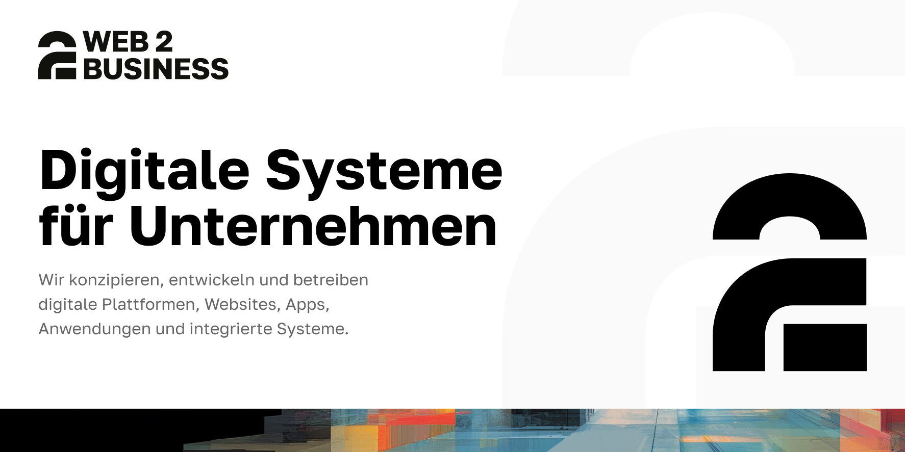

  

<h1 align="center">Digital systems for companies.</h1>

  W2B designs, develops and operates digital platforms, websites, apps,
  applications and integrated systems for companies that need more than a
  standard web presence.

---

## What we build

| Area | Focus |
| --- | --- |
| **Websites & platforms** | Responsive websites and web applications built around real business goals. |
| **E-commerce** | Online shops and sales systems tailored to existing processes and future growth. |
| **Apps** | Mobile and digital applications shaped around clear requirements and everyday use. |
| **Custom software** | Portals, programs and integrated workflows for companies outgrowing manual tools. |
| **Search & visibility** | SEO, SEA and SEM work that helps customers find the right offer. |
| **Hosting & operations** | Scalable, cloud-based and privacy-conscious hosting for digital projects. |

## How we work

We keep projects honest, transparent and fair: clear requirements, realistic
effort estimates, direct communication and reliable implementation from the
first consultation through launch and ongoing operation.

## Contact

[web2business.de](https://web2business.de/) ·
[info@web2business.de](mailto:info@web2business.de) ·
Rottenburg a. d. Laaber, Germany
